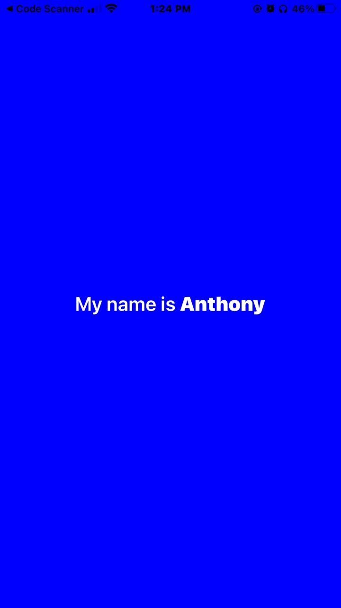

# React Native Assignment 2
## Student ID
11313275

## Description
This project is a simple React Native application created using Expo CLI. The application displays a text with a blue background color, font size 24, and a bold name (Anthony).

## Task Details
- The background color of the View component was changed to blue.
- Display the text "My name is Anthony" with "" being bold.
- Increase the font size of the text to 24.

## Screenshot
